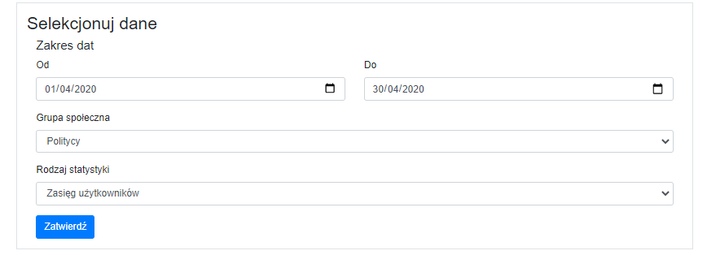
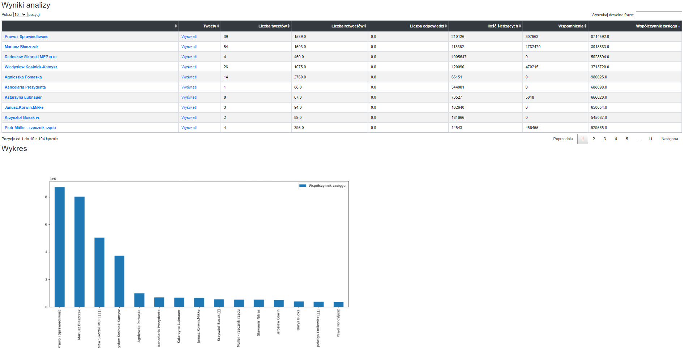
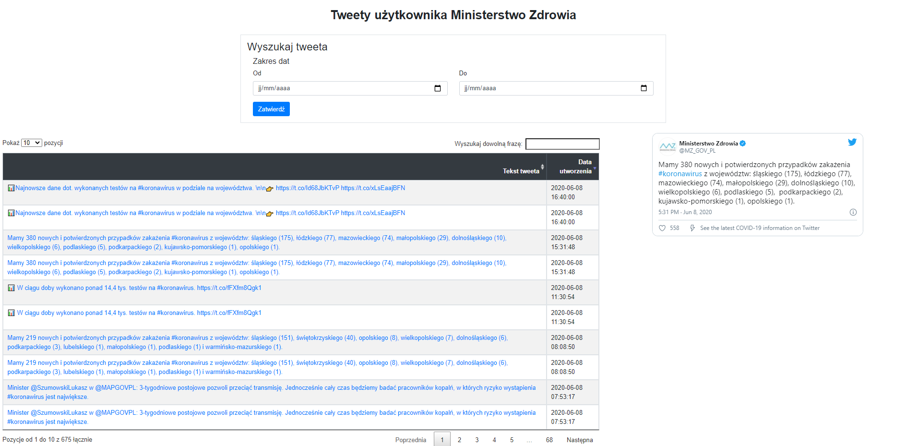

# COVID tweet analysis
Covid tweet analysis is an application for computing statistics about Polish tweets concerning Covid pandemic in Poland.

## How it works
When the application builds, the tweets (stored in MongoDB BSON format in `mongo/tweets` directory) are loaded into the database. From the main page, user can choose which statictic they want to see. Also date range and user group filters can be specified. After submitting the form, appropriate queries are performed and the result is displayed in graphical form. Application also makes it possible to browse specific users' tweets and display variuos data about their accounts.

## How were the tweets collected
Tweets were collected using official Twitter API from free 7-day endpoint. Fetching scripts are stored in `fetch/` directory. Every week from late March until May 2020, a script was run to get the tweets from the last week. The list of accounts being searched for can be found in `fetch/weekly_fetch.py` file. A tweet was considered relevant if it contained "koronawirus" (coronavirus) word (we found it to be the best keyword to check against). Also, tweets were split depending on author's social group (politicians by political affiliation, medics, artists, journalists and influencers). Such an approach let us collect over 150K tweets in 10 collections.

## How to build
* Place extracted tweet collections in BSON format in `mongo/tweets/` directory (sample dataset can be found [here](https://drive.google.com/file/d/1wphr_CfjmV4pUreXEwaR_eFU9kLrqsEX/view)) 
* In main project directory, run `$ docker-compose up`, it will download required Docker images and run the application

## Usage examples

## Tech stack
- Python and [Flask](https://flask.palletsprojects.com/en/1.1.x/) used to create web application
- [Tweepy](https://www.tweepy.org/) as a wrapper for [Twitter API](https://developer.twitter.com/en/docs)
- [MongoDB](https://www.mongodb.com/) as a database and its API for Python, pymongo
- [Pandas](https://pandas.pydata.org/), [Matplotlib](https://matplotlib.org/) and [Scikit-learn](https://scikit-learn.org/stable/) for performing computation and presentation of statistics
- Containerized with [Docker and Compose](https://www.docker.com/)
